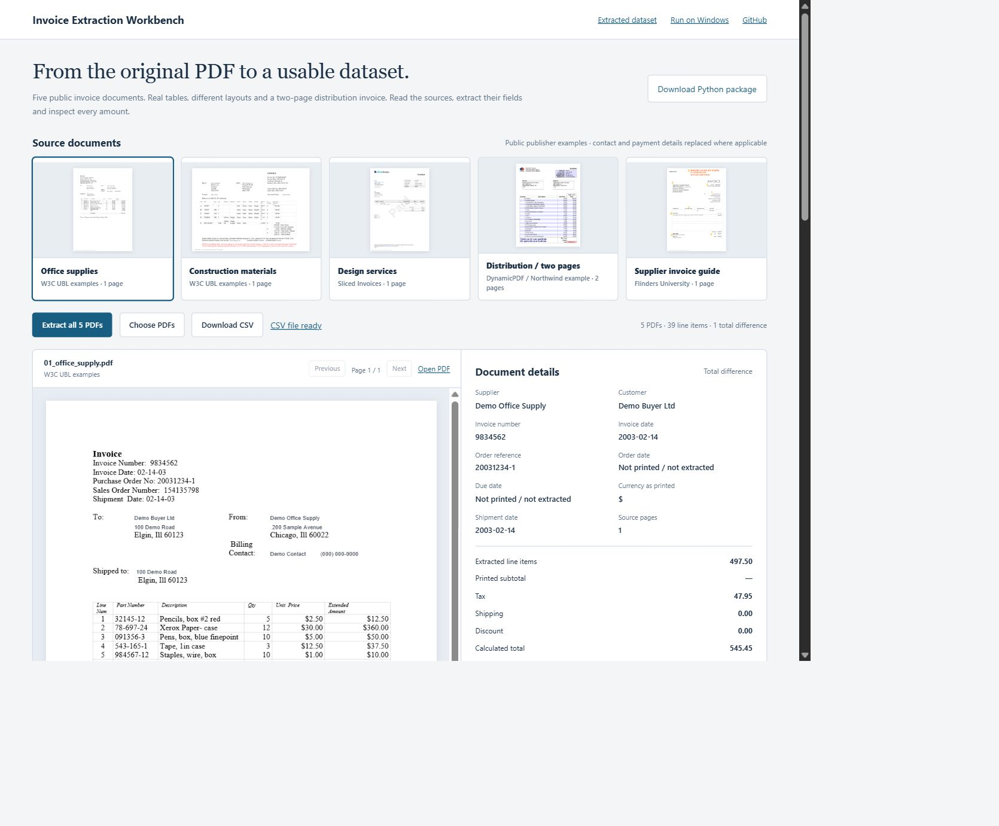
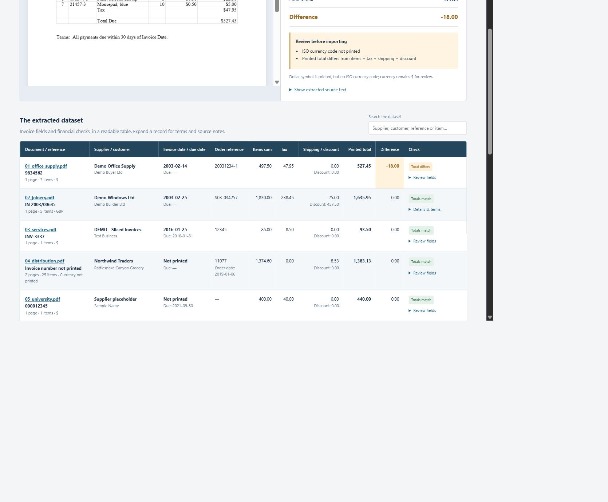

# Invoice Extraction Workbench

Extract PDF invoice fields and line items into a detailed CSV, with a browser workspace for reviewing each source document and checking its totals.

**[Open the interactive workbench](https://enybyy.github.io/invoice-extraction-workbench/)** · [Windows package](Invoice_Extractor_Package.zip) · [Extracted CSV](outputs/public-invoices/invoices.csv)





## Explore the documents

The gallery shows five PDF examples downloaded from their publishers: W3C UBL office supplies and construction invoices, Sliced Invoices services, DynamicPDF's two-page Northwind distribution invoice, and Flinders University's annotated supplier guide.

Click **Extract all 5 PDFs**. PDF.js reads their actual pages; the extractor builds a five-record invoice table and a **39-row line-item table**. Search by supplier, customer, reference or description; filter line items by document; follow a row to its source page; expand terms and extraction notes. Download the combined dataset as CSV.

These are public publisher examples, not past customer projects. Four copies replace contact/payment details while keeping the original layouts and invoice values. The Northwind example already uses fictional training data and remains unmodified. [sources.json](sources.json) records publisher URLs, changes and file hashes.

## Run on Windows

1. Extract the ZIP package.
2. Install Python 3.12+ with **Add Python to PATH**.
3. Double-click `setup.cmd` once.
4. Place PDF files in `inputs`; move the five included examples out before processing your own batch.
5. Double-click `run.cmd`. Open `output/invoices.csv` and `output/review.html`.

```sh
python -m pip install -r requirements.txt
python extract_invoices.py --input inputs --output output --mode local
```

Original inputs stay unchanged. CSV uses UTF-8 with BOM for Excel compatibility. One row represents one line item, with a placeholder row when extraction fails so files are not silently dropped.

## What the dataset preserves

Supplier and customer; invoice reference and date; the original date string; due, order and shipment dates; purchase/sales orders; delivery reference; source page; SKU and item description; unit, quantity, price and printed line amount; tax, shipping, discount, printed total and reconciliation; payment terms, profile, review reasons and source notes.

Missing values remain empty. The Northwind source prints an order ID and order date, but no separately labelled invoice number, invoice date or currency: those are separate fields rather than invented invoice details. The university source contains placeholders and amount-only lines, so supplier, invoice date, quantity and unit price require review. A dollar sign is preserved as `$`, not guessed to mean a particular ISO currency. The UK construction profile maps its pound symbol to GBP.

Invoice totals repeat in CSV line-item rows. **Do not sum repeated invoice totals or aggregate different currencies.** Use the invoice-level JSON or the browser's invoice table for invoice-level review.

## Financial reconciliation

The extractor independently checks printed line amounts against quantity × unit price, and compares:

`sum of printed line amounts + tax + shipping - discount = expected invoice total`

Tolerance is 0.01. Printed amounts are retained rather than corrected. In the construction example, the discount is calculated from its printed gross and post-discount totals; the printed VAT is retained because the source describes a settlement-discount tax basis.

The public office-supplies PDF has line amounts totaling **497.50**, tax **47.95** and a printed total of **527.45**. The computed total is **545.45**, so the source produces a genuine **-18.00 difference**. The other four totals reconcile; incomplete metadata still requires review.

## Extraction profiles and AI

Python and the browser share [public_profiles.json](public_profiles.json). Rules read text and parse layout-specific headers and tables; they do not load prefilled results as the extraction output. The published CSV/JSON are a separately captured batch. Legacy fixtures remain in `tests/fixtures`.

Local mode supports the five public profiles and three legacy text layouts. Unknown suppliers, complex tax treatments and image-only scans need additional rules, OCR or validated AI extraction. PDFs are limited to 20 MB and 30 pages each; encrypted documents require an unprotected copy.

The optional `run_ai.cmd` uses the OpenAI Responses API with PDF inputs and structured output, followed by the same Python arithmetic checks. Set `OPENAI_API_KEY` and `OPENAI_MODEL` in your environment. The launcher asks before sending PDFs to OpenAI; API usage may incur charges. Never place keys in the browser or repository. Live AI extraction has not been validated with an API account or customer invoices.

Official documentation: [file inputs](https://developers.openai.com/api/docs/guides/file-inputs), [structured outputs](https://developers.openai.com/api/docs/guides/structured-outputs).

## Sources

- [W3C office-supplies example](https://www.w3.org/XML/Binary/2005/03/test-data/UBL-1.0/fs/Invoice/pdf/OfficeInvoice.Example-a4.pdf)
- [W3C construction example](https://www.w3.org/XML/Binary/2005/03/test-data/UBL-1.0/fs/Invoice/pdf/JoineryInvoice.Example-a4.pdf)
- [Sliced Invoices service example](https://slicedinvoices.com/pdf/wordpress-pdf-invoice-plugin-sample.pdf)
- [DynamicPDF two-page Northwind example](https://www.dynamicpdf.com/Products/DynamicPDF/Examples/Web_CSharp/ReportWriterExamples/InvoiceExample.aspx)
- [Flinders University supplier guide](https://staff.flinders.edu.au/content/dam/staff/finance/sample-inv-draft.pdf)

Publisher documents and trademarks belong to their respective owners. These copies demonstrate extraction and do not represent affiliations or client engagements. PDF.js is included under Apache 2.0; see `vendor/PDFJS-LICENSE`.

## Verification

```sh
python -m unittest discover -s tests -v
node tests/test_browser.mjs
node tests/test_public_browser.mjs
```

Checks cover the five real downloaded PDFs, 39 items, both pages of the distribution source, original discrepancies, discount calculation, incomplete fields, duplicate preservation and malformed files. Browser-derived text is compared with the Python extraction for quantities, line amounts, identifiers, dates and totals. Passing these profiles does not establish accuracy on unseen vendor layouts.

Earlier [Generar RH](https://github.com/Enybyy/rh-document-generator) work includes PDF receipt extraction for series, date and total alongside Excel-to-Word document generation.

---

**Eliud Rojas Mendoza · Enybyy** · [GitHub](https://github.com/Enybyy) · [Upwork](https://www.upwork.com/freelancers/eliudevelopment)
